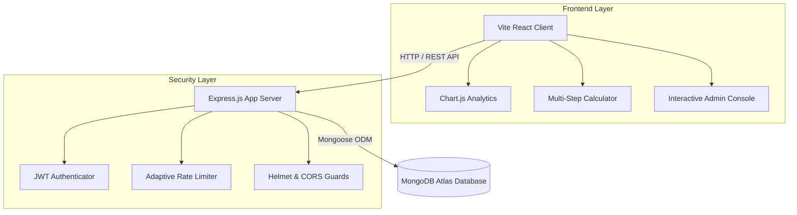

# 🍃 EcoTrack – Carbon Footprint Awareness & Management Platform

EcoTrack is a premium, production-grade MERN (MongoDB, Express, React, Node.js) web application designed to help users calculate, analyze, and offset their daily carbon footprint. Through precise calculator coefficients, customized vehicle-type emissions, visual analytics dashboards, gamified badges, target goals, and administrative control workspaces, EcoTrack guides users toward sustainable living.

---

## 🌟 Key Features (What Sets EcoTrack Apart)

*   **Dynamic Car Engine Customization**: Tracks car commutes dynamically by applying distinct, realistic coefficients for Electric (EV), Hybrid, Gasoline (Standard), and Diesel engines.
*   **Timeframe-Filtered Analytics**: Visualizes carbon emission trends over time with responsive Chart.js line and bar graphs. Users can filter views by `Last 7 Days`, `Last 30 Days`, or `All Time`.
*   **Admin-Centric Controls**: 
    *   **Unified Panel**: Manage platform users, suspend/reactivate accounts, delete users, and track platform metrics in real time.
    *   **CMS Education Desk**: Publish, edit, or delete sustainability articles directly from the UI.
    *   **Privilege Profile**: Displays platform access summaries and active system permissions.
*   **Gamified Badge Achievements**: Awards system badges dynamically (*Green Beginner*, *Carbon Saver*, *Eco Warrior*, *Sustainability Champion*) based on submission logs and carbon savings.
*   **Secured Platform Engineering**: Equipped with JWT session tokens, bcryptjs encryption, Helmet HTTP headers, CORS controls, and adaptive environment-specific API rate limiters.

---

## 📐 Architecture Overview



---

## 🛠️ Technical Stack

*   **Frontend**: React.js (Vite, Javascript), Bootstrap 5, Bootstrap Icons, Chart.js & React-Chartjs-2
*   **Backend**: Node.js, Express.js REST API
*   **Database**: MongoDB (Atlas) & Mongoose ODM
*   **Authentication**: JWT & Password Hashing via bcryptjs
*   **Security**: Helmet.js, CORS, Express Rate Limit, Express Validator Input validation

---

## ⚙️ Local Setup & Getting Started

### Prerequisites
*   [Node.js](https://nodejs.org/) (v16.0.0 or higher)
*   [MongoDB Atlas](https://www.mongodb.com/cloud/atlas) account (or a local MongoDB instance running on port `27017`)

### Installation & Initialization

1.  **Clone the Repository**:
    ```bash
    git clone https://github.com/rishiklucky/EcoTrack.git
    cd EcoTrack
    ```

2.  **Install All Dependencies**:
    Runs concurrent installations for root, backend, and frontend directories:
    ```bash
    npm run install-all
    ```

3.  **Configure Environment Variables**:
    Create a `.env` file in the `/backend` folder:
    ```env
    PORT=5000
    MONGO_URI=your_mongodb_atlas_srv_connection_string
    JWT_SECRET=your_jwt_signing_token_secret
    NODE_ENV=development
    ```

4.  **Seed the Database**:
    Initializes BADGES, initial sample articles, and default credentials:
    ```bash
    npm run seed
    ```
    > [!IMPORTANT]
    > **Default credentials created by the seeder:**
    > *   **Regular User**: `user@ecotrack.com` / Password: `User@123`
    > *   **Admin User**: `admin@ecotrack.com` / Password: `Admin@123`

5.  **Run Locally**:
    *   **Backend Server**: `npm run dev-backend` (from root)
    *   **Frontend Client**: `npm run dev-frontend` (from root)
    *   *Open your browser to:* `http://localhost:5173`

---

## 🧪 Verification & Automated Testing
Run the backend test suites to verify calculator coefficients and emissions calculations:
```bash
npm test
```

---

## ☁️ Production Deployment Guide (Render)

This project is configured to run as a **single web service** on Render (Express hosting and serving the compiled React static files):

1.  Create a new **Web Service** on Render and link your GitHub repository.
2.  Set the **Build Command** to: `npm run build`
3.  Set the **Start Command** to: `npm run start`
4.  Configure the environment variables in Render:
    *   `NODE_ENV` = `production`
    *   `MONGO_URI` = `[Your Atlas MongoDB String]`
    *   `JWT_SECRET` = `[Your JWT secret]`
5.  Deploy the service. The build script will compile the client assets into `frontend/dist` and start serving them.
